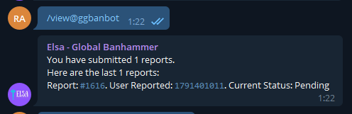

# Commands

### User Commands
- /new or /report - Create a new report. Must be used replying a message

- /view - View latest 10 reports you have sent to Elsa

- /show {report} - View data about a specific report

- /me - Show the data the bot have about the user

- /comment {report} - Add a new comment on an existing report.
- /about {id} - View info about a user. Can be used with @username, user_id or replying. Only will appear the data if Elsa have info about this user before the command.

- /stats - View bot statistics

- /ticket or /issue - View bot service web
- /help - Show the commands list you have available on Elsa

### Moderator Commands
- /viewall or /all - View all open reports
- /accept {report} - Accept a report and send it to admins
- /reject {report} - Reject a report
- /search {id} - View all reports about a user
- /newid or /reportid {id} {reason}  - Create a new report with a single id