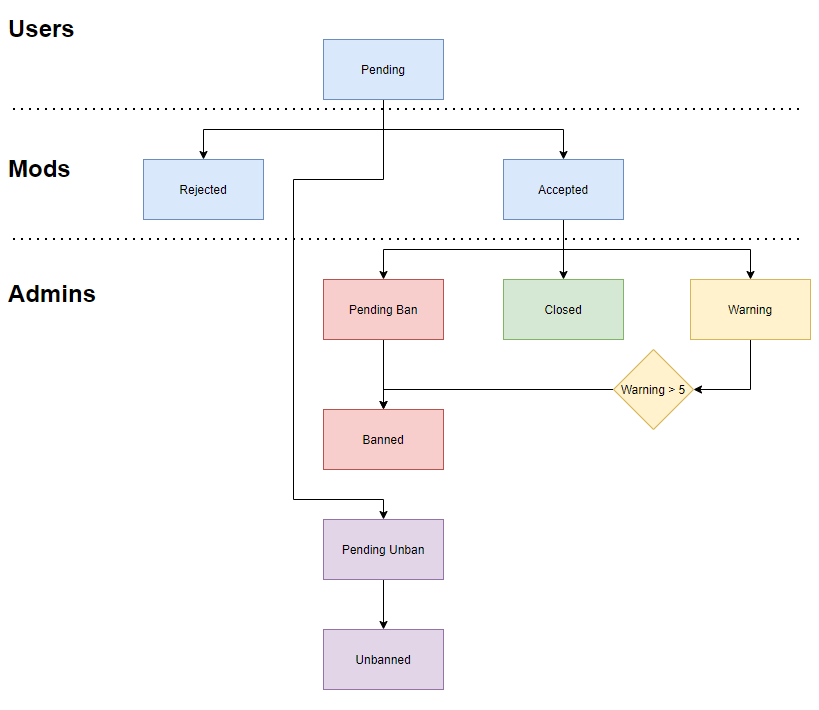

## Flow
A small flow diagram to ilustrate how report work

# Reports
- When a report is created using /report or /new, the process begins as Pending.
- A moderator then filter the request if can be reported or if it's not a valid report. 
This will be automatic in the near future when available.
- An admin then can execute a global ban, warning the user or close the report if
thinks it's not enough to warn the user.
- When a user has been warned 5 times (this number can change) the bot will automatically ban the user.

## How to Report
- You can report using the command /report and replying a message or using the ticketing system and the "Ban request" template
- If you think you must provide more data to the report, you can also add more messages using the /comment command
- Before a mod/admin check the report, you can also close it using /close

To enter the ticketing system, [enter here](https://github.com/TheWNetwork/ggbanbot-issues/issues)

# Claim
You can claim a ban on our ticketing system and filling the "Ban Claim" template 
To enter the ticketing system, [enter here](https://github.com/TheWNetwork/ggbanbot-issues/issues)
