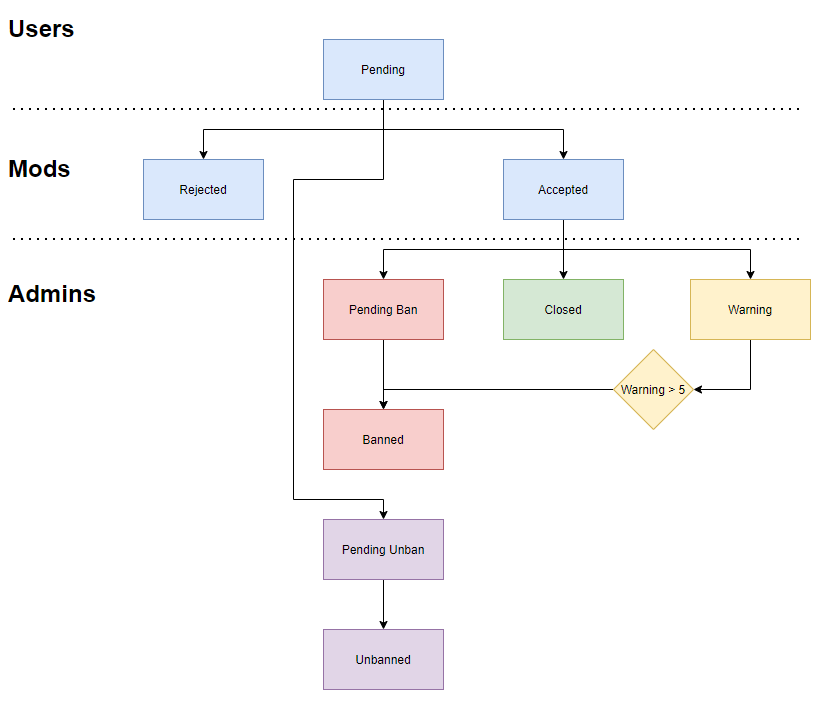

# Flujo de Reporte

## Diagrama de Flujo
A continuación se muestra un breve diagrama que ilustra cómo funciona el sistema de reportes:

---

# Funcionamiento de los Reportes

- **Estado Inicial:** Cuando se crea un reporte utilizando los comandos `/report` o `/new`, el proceso comienza en estado **Pendiente**.
- **Filtrado:** Un moderador filtra la solicitud para determinar si es un reporte válido o si debe ser descartado. *(Este proceso se automatizará próximamente mediante IA)*.
- **Resolución:** Un administrador puede ejecutar un veto global (*global ban*), emitir una advertencia (*warning*) o cerrar el reporte si considera que el contenido no justifica una sanción.
- **Acumulación de Advertencias:** Cuando un usuario acumula 5 advertencias (este valor puede variar según la configuración), el bot aplicará automáticamente un veto global.

---

## Cómo Enviar un Reporte

1. **Desde un Grupo:** Puedes reportar directamente respondiendo al mensaje del infractor con el comando `/report`.
2. **Sistema de Tickets:** También puedes abrir una solicitud utilizando el sistema de soporte con la plantilla *"Ban request"*.
3. **Añadir Información:** Si necesitas aportar más datos o contexto al reporte, puedes adjuntar mensajes adicionales con el comando `/comment`.
4. **Cancelar Reporte:** Antes de que un moderador o administrador revise la solicitud, puedes cerrarla tú mismo mediante el comando `/close`.

👉 [Acceder al sistema de soporte y tickets](https://t.me/twn_supportbot)

---

# Apelaciones y Reclamaciones

Si has sido vetado, puedes apelar la decisión a través de nuestro sistema de soporte completando la plantilla *"Ban Claim"*.

👉 [Acceder al sistema de soporte para apelar](https://t.me/twn_supportbot)

> **Nota importante:** Si el veto ha sido validado por contenido de **CSAM / MASI** (Material de Abuso Sexual Infantil), **no se aceptará ninguna apelación** bajo ningún concepto.
